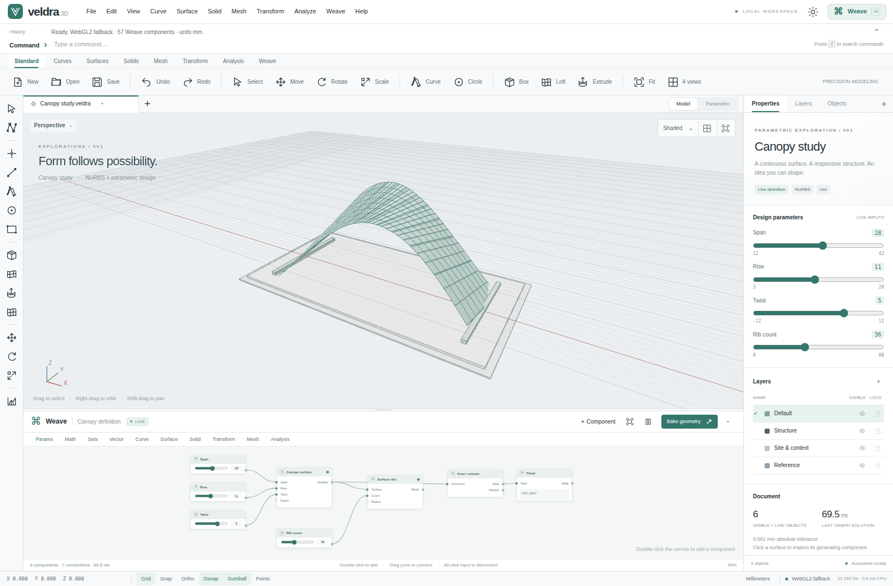

# Veldra 3D + Weave

**An independently implemented browser NURBS modeler, visual parametric workspace and final-render studio.**

**[Launch Veldra 3D](https://wieslawsoltes.github.io/Veldra3D/)** · [Standalone HTML](https://wieslawsoltes.github.io/Veldra3D/Veldra3D.html) · [Build and deployment](https://github.com/wieslawsoltes/Veldra3D/actions/workflows/pages.yml)

Veldra uses plain HTML, CSS, JavaScript modules and original WGSL shaders. There are no runtime frameworks, external fonts, CDNs, cloud services or package dependencies. The interface combines a command line, modeling toolbars, construction-plane viewports, inspectors, layers, the dockable Weave node editor and a separate final-render window.

This is a substantial working **0.2 implementation**, not a screenshot mockup and not a complete production CAD replacement. It does not implement full Rhino/Grasshopper compatibility or load their native document/plugin formats. See [CAD capabilities](docs/CAPABILITIES.md) and [final rendering](docs/FINAL-RENDERING.md) for exact capabilities, approximations and remaining boundaries.



## Final rendering — new in 0.2

Use **Render → Render final image**, press **F9**, or open **Render** at the top right. The old viewport **Rendered** display mode remains raster shading; final rendering is now a separate real progressive path tracer.

The new studio includes resolution and sample presets, configurable bounce depth, WebGPU compute tracing and a real CPU Web Worker fallback, pause/resume/stop/restart, progress, actual backend diagnostics, image comparison and full-resolution exports. Visible document geometry and live Weave previews are rendered without grid, selection or control-point overlays.

Materials include GGX opaque reflection, diffuse transport, smooth dielectric glass/refraction, metallic, roughness, transmission, IOR, emission, bitmap base color and checker patterns. Lighting includes HDR/LDR image environments with importance sampling, a sky environment, sun, point, spot and rectangular lights, emissive objects, soft shadows, and multibounce indirect illumination. Perspective and orthographic cameras support a physical aperture diameter and focus distance. An optional ground plane and transparent camera background are included.

Develop the image with exposure, an ACES-fitted curve or Reinhard tone mapping and optional normal/depth/albedo-guided spatial denoising. Inspect Beauty, Albedo, World normals, Camera depth and Sample count. Save **PNG, JPEG, Radiance HDR, or float32 multilayer OpenEXR**. HDR/EXR retain unfiltered scene-linear data; PNG/JPEG save the developed display pass. Render settings, lights and embedded material textures are saved in `.veldra` files and participate in document history.

[Render controls, architecture, formats, tests and limits](docs/FINAL-RENDERING.md)

## Run

Use Node.js 20 or newer:

```sh
npm start
```

Open `http://localhost:8080` in a browser. No `npm install` is required. Alternatively:

```sh
python3 -m http.server 8080 --bind 127.0.0.1
```

The application is static. Any HTTPS static host can serve it without a backend. If port 8080 is occupied, set the `PORT` environment variable before `npm start`.

`dist/Veldra3D.html` contains the entire application, including the final-render modules and worker kernel, in one file. It can be served without adjacent assets. Direct file opening may select a fallback depending on browser security and graphics support; localhost is recommended.

**WebGPU requires a secure context and an available adapter.** The viewport reports WebGPU, WebGL2 fallback or software rasterization. The final-render window separately reports WebGPU compute or CPU worker path tracing. CPU final rendering computes real light transport; it is not the reduced-fidelity viewport fallback. Forced WebGPU mode reports an initialization error rather than claiming GPU execution when unavailable. See [WebGPU](https://developer.mozilla.org/en-US/docs/Web/API/WebGPU_API) and [secure contexts](https://developer.mozilla.org/en-US/docs/Web/Security/Secure_Contexts).

## GitHub Pages

Pushes to `main` run core tests, build the standalone application, execute modeling and final-render browser checks, stage public assets and deploy the site over HTTPS. A separate forced-WebGPU final-render test records the adapter and requires shader execution; it does not silently skip unsupported adapters.

Run `npm run build:pages` to reproduce the static site in `_site/`. Relative paths support the `/Veldra3D/` project prefix. The published `build-info.json` identifies the source commit. Generated distribution files, screenshots and reports are refreshed by the successful workflow without overwriting a concurrently advanced source branch. See [Publishing](docs/PUBLISHING.md).

## First five minutes

The initial canopy is generated by an eight-component Weave definition with four editable number sliders. Change **Span**, **Rise**, **Twist** or **Rib count** in the inspector or graph; the surface and ribs regenerate.

Right-drag to orbit, middle-drag or Shift-drag to pan, and scroll to zoom. `Home` frames the model; `F` frames the selection. The four-view button opens Top, Perspective, Front and Right. Double-click a viewport title to maximize it. Touch supports tap selection, single-finger orbit and two-finger pan/zoom.

Type `Box 8 6 5` into the command line. With the box selected, type `Move 2 3 4`. Use `Undo` and `Redo`. Numeric commands reject malformed or out-of-range arguments. Commands without arguments open a parameter dialog when appropriate.

Choose a curve tool and click points on the active construction plane. Enter completes a multi-point curve; Escape cancels. While drawing, enter exact points as `x,y,z`. Grid snapping, object snapping and Ortho are available on the status bar.

Choose **Bake geometry** to turn live outputs into independent editable document objects. Baking hides those previews; undo/redo restores geometry and preview states. Select a baked NURBS surface, enable **Points**, and drag its control net. The underlying control points are edited and the display mesh regenerated.

In Weave, double-click the canvas or choose **+ Component**. Drag node headers and connect compatible ports. Alt-click an input to disconnect it. Illegal cycles and incompatible ports are rejected. Select a component to edit unconnected inputs. A paused graph retains its last solution.

Use **Save** to download a `.veldra` document with the graph, final-render settings, lights and materials. Autosave is a convenience, not a backup. Private contexts or large embedded images may exceed browser storage permissions/quotas; native file saving remains the intended retention path.

## Implemented scope

| Area | Working capabilities |
|---|---|
| Modeling workspace | 104 modeling commands plus nine final-render commands; search; numeric arguments; four cameras; selection; translation gumball; control-point editing; undo/redo; copy/paste; arrays; layers; visibility; locking; light/dark UI |
| Curves | Rational NURBS evaluation; analytic derivative; curvature; exact circles/arcs; interpolated curves; polylines, rectangles, ellipses, polygons and helices; knot insertion, split and reversal; adaptive display tessellation; length and sampled closest-point refinement |
| Surfaces | Rational tensor-product NURBS and analytic partial derivatives; control nets; plane/patch; extrusion; loft; revolve; transported-frame sweep; pipe; sampled isocurves |
| Polygon solids | Primitives; capped extrusion/pipe; BSP mesh booleans; edge-conformity repair and output manifold checks; welding; Loop subdivision; sections; triangle-BVH picking |
| Weave | 57 components; typed ports; data trees; list operations; cycle rejection; dependency ordering; cached recomputation; errors and upstream propagation; previews; references; baking; graph persistence and history |
| Viewport rendering | WebGPU batched rasterization, 4× MSAA, depth-tested edges, directional shadow map, material shading, grid, zebra/normal modes and clipping; generic NURBS compute evaluator; WebGL2 and software fallbacks |
| Final rendering | Independent CPU/WebGPU path tracers, multibounce lighting, MIS, glass/reflection, editable lights and materials, HDR environments, depth of field, ground, progressive jobs, development controls, AOVs and real image export |
| Files | `.veldra` and `.weave`; OBJ, STL and limited DXF import/export; embedded-buffer glTF export; viewport PNG; final PNG/JPEG/HDR/EXR; local autosave |

Component and command inventories for the original modeling workspace are in [Components](docs/COMPONENTS.md) and [Commands](docs/COMMANDS.md). Final-render commands and controls are documented separately in [Final rendering](docs/FINAL-RENDERING.md).

## Verification

```sh
npm test
npm run build
node tools/benchmark.mjs
python3 tests/browser_smoke.py --chromium /path/to/chromium
python3 tests/final-render-browser.py --chromium /path/to/chromium
```

The final-render implementation's local run passed **94 Node tests**, **22 existing modeling browser checks** and **19 final-render checks with real CPU workers**. The latter exercises actual radiance/AOV buffers, UI responsiveness, material and light persistence, EXR downloads, pause/resume/cancel, restart and mobile layout. No uncaught JavaScript or console errors were recorded.

The local test browser did not expose WebGPU in its permitted origin. Those local passes therefore do **not** certify GPU execution. CI separately runs the final-render checks on a secure local URL with forced WebGPU and records the actual adapter. Consult its current result and artifacts for GPU verification; software-adapter execution does not establish discrete-GPU performance. The Node WGSL structure check is not a shader compiler test.

```sh
python3 tests/final-render-browser.py --chromium /path/to/chromium --url http://localhost:8080/ --require-webgpu
```

For the original viewport and NURBS GPU evaluator, serve and open `tests/gpu.html`. Unsupported environments report skipped, not passed. Playwright and Chromium are development-only dependencies. Workflow artifacts preserve separate standalone, module, CPU and WebGPU results. See [Testing](docs/TESTING.md) for the original 0.1 record and [Final rendering](docs/FINAL-RENDERING.md) for 0.2 tests and qualifications.

## Source layout

```text
src/core/           Math, NURBS, meshes, booleans, BVH, document, graph, I/O
src/render/         Viewport cameras, raster backends and shader modules
src/render/final-*  Scene compiler, CPU kernel, WGSL, jobs, images and render UI
src/ui/             Modeling commands, dialogs, menus and graph interaction
src/app.js          Modeling integration, editing, inspectors and persistence
examples/           Editable native models and graphs
tests/              Geometry, rendering, browser integration and GPU checks
tools/              Static server, bundler, Pages staging, benchmarks
dist/               Complete standalone HTML application
```

The final-render UI installs through a separate module and uses the existing document, geometry and command APIs. Both entry modules are included in the standalone bundler. See [Architecture](docs/ARCHITECTURE.md) and the new [rendering architecture](docs/FINAL-RENDERING.md).

## Boundaries

General trimmed B-rep topology, robust analytic surface intersections/booleans, production fillet/blend/chamfer solvers, universal offset/join/trim operations, exact surface integration, drafting layouts and dimensions, native `.3dm`/`.gh`/`.ghx`, STEP/IGES, plugin runtime compatibility and manufacturing modules remain absent.

Final rendering now exists, but it is not a complete production-renderer replacement. Volumes, subsurface scattering, hair, motion blur, rough dielectric transmission, full UV/PBR map authoring, normal/displacement mapping, material node graphs, distributed rendering and compressed/multipart EXR are not implemented. See the detailed limits rather than assuming feature parity from the UI.

Heavy geometry/graph evaluation, final tessellation and BVH construction remain synchronous on the main thread. Tracing itself runs on WebGPU or actual CPU workers. Final geometry is limited to 500,000 triangles and output to 8,388,608 pixels, subject to adapter/memory limits. Mesh booleans operate on tessellated solids, not a general exact B-rep kernel. No broad production certification is claimed.

## License

MIT. The original implementation adds no proprietary code, plugin binaries, copied icons or bundled font files. Product names mentioned for comparison remain the property of their respective owners; this project is independent and unaffiliated.
